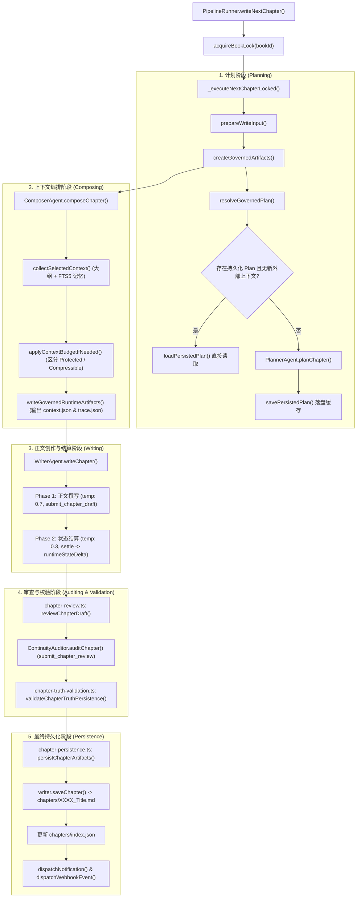

# InkOS Architecture Audit: Current Pipeline

> 本文档为 **Author-Mind Edition Phase 0 只读架构审计** 的核心交付物。  
> 审计基准分支：`feature/author-mind`  
> 基线 Commit SHA：`8fc2ae57080b9821257dee3e37cc677e2b6f389a`  
> 审计原则：纯只读分析，基于实际代码实现，不基于推测；明确区分权威数据源与衍生投影。

---

## 目录
- [1. Plan Chapter 到正文生成的完整调用链](#1-plan-chapter-到正文生成的完整调用链)
- [2. Planner 的位置与实现](#2-planner-的位置与实现)
- [3. Planner 结构化输出（Structured Output）的定义与协议](#3-planner-结构化输出structured-output的定义与协议)
- [4. Chapter Intent Schema 定义](#4-chapter-intent-schema-定义)
- [5. 权威数据源（Authoritative Data）与存储](#5-权威数据源authoritative-data与存储)
- [6. 衍生 Markdown 投影（Projections）清单](#6-衍生-markdown-投影projections清单)
- [7. Persisted Plan 的写入与读取机制](#7-persisted-plan-的写入与读取机制)
- [8. Composer 的上下文组装机制](#8-composer-的上下文组装机制)
- [9. Context Budget（Token 预算）工作原理与分级保护](#9-context-budgettoken-预算工作原理与分级保护)
- [10. Rule Stack（规则栈）的构造与流转](#10-rule-stack规则栈的构造与流转)
- [11. Writer 实际接收的 Payload 结构](#11-writer-实际接收的-payload-结构)
- [12. Writer 输出进入 Audit 的流转链路](#12-writer-输出进入-audit-的流转链路)
- [13. Audit 观察进入 Revision 的流转链路](#13-audit-观察进入-revision-的流转链路)
- [14. Canon 与 State 的存储架构](#14-canon-与-state-的存储架构)
- [15. SQLite Memory 的定位与职责](#15-sqlite-memory-的定位与职责)
- [16. Studio 与 Core 的交互机制](#16-studio-与-core-的交互机制)
- [17. Creative Contract 的最佳注入点](#17-creative-contract-的最佳注入点)
- [18. 明确禁止修改的底层模块](#18-明确禁止修改的底层模块)
- [19. 向后兼容性风险分析](#19-向后兼容性风险分析)
- [20. 推荐的最小侵入式改造设计方案](#20-推荐的最小侵入式改造设计方案)

---

### 1. Plan Chapter 到正文生成的完整调用链

章节生成的生命周期统一由 `packages/core/src/pipeline/runner.ts` 中的 `PipelineRunner` 类编排调度：



---

### 2. Planner 的位置与实现

* **核心执行类**：[`packages/core/src/agents/planner.ts`](file:///f:/novel2/inkos/packages/core/src/agents/planner.ts) 中的 `PlannerAgent`（继承自 `BaseAgent`）。
* **提示词组装**：[`packages/core/src/agents/planner-prompts.ts`](file:///f:/novel2/inkos/packages/core/src/agents/planner-prompts.ts) 提供 `getPlannerMemoSystemPrompt` 与 `buildPlannerUserMessage`。
* **工具契约**：[`packages/core/src/agents/planner-tool.ts`](file:///f:/novel2/inkos/packages/core/src/agents/planner-tool.ts) 定义 `ChapterMemoToolSchema`。
* **物料准备**：[`packages/core/src/utils/planning-materials.ts`](file:///f:/novel2/inkos/packages/core/src/utils/planning-materials.ts) 的 `loadPlanningSeedMaterials` 读取上一章末尾摘录、当前焦点（`currentFocus`）、作者初始意图（`authorIntent`）及作品简述（`brief`）。

---

### 3. Planner 结构化输出（Structured Output）的定义与协议

Planner 与大模型交互采用类型化的 Tool Call 机制，工具名为 `submit_chapter_memo`：

* **Schema 定义**（`packages/core/src/agents/planner-tool.ts`）：
  ```typescript
  export const ChapterMemoToolSchema = Type.Object({
    goal: Type.String({ minLength: 1, description: "本章核心叙事目标" }),
    body: Type.String({ minLength: 1, description: "章节分场与具体事件意图 Markdown" }),
    threadRefs: Type.Array(Type.String(), { description: "引用的伏笔/线索 ID 列表" }),
  });
  ```
* **运行时输出模型**（`packages/core/src/models/input-governance.ts`）：
  ```typescript
  export const ChapterMemoSchema = z.object({
    chapter: z.number().int().min(1),
    goal: z.string().min(1),
    body: z.string().min(1),
    threadRefs: z.array(z.string()),
  }).strict();
  ```

---

### 4. Chapter Intent Schema 定义

定义于 [`packages/core/src/models/input-governance.ts`](file:///f:/novel2/inkos/packages/core/src/models/input-governance.ts)：

```typescript
export const ChapterIntentSchema = z.object({
  chapter: z.number().int().min(1),
  goal: z.string().min(1),
}).strict();

export type ChapterIntent = z.infer<typeof ChapterIntentSchema>;
```

在系统内部，轻量级的 `ChapterIntent` 记录核心标靶，而更为具体的规划落地承载于 `ChapterMemo` 中。

---

### 5. 权威数据源（Authoritative Data）与存储

InkOS 架构严格贯彻 **「机器结构化数据权威，Markdown 仅作人类投影」** 的原则：

| 领域 | 权威存储路径 | 数据格式 | 说明 |
| :--- | :--- | :--- | :--- |
| **章节计划缓存** | `story/runtime/chapter-XXXX.plan.json` | JSON (`PersistedPlanSchema`) | 存储版本号、`intent`、`memo`、`plannerInputs`，用于跳过重复推理 |
| **本书规则约束** | `story/book_rules.json` | JSON (`BookRulesSchema`) | 主机强制执行的约束（人称、主角性格锁、行为禁忌等） |
| **运行时状态机** | `story/state/current_state.json` | JSON (`RuntimeStateSchema`) | 角色心理状态、知晓信息、阵营、关系、世界变量 |
| **伏笔追踪** | `story/state/hooks.json` | JSON (`HooksStateSchema`) | 伏笔状态机（`unresolved / progressing / resolved / superseded`） |
| **历史摘要** | `story/state/chapter_summaries.json` | JSON (`ChapterSummariesStateSchema`) | 各章正式落盘的摘要索引 |
| **历史快照** | `story/state/snapshots/chapter-XXXX/` | JSON Files | 每章完结后的全量状态切片，支持精准回滚 |
| **作品清单** | `source/work.json` (或 `book.json`) | JSON (`WorkManifestSchema`) | 作品档案、衍生关系、产物索引 |

---

### 6. 衍生 Markdown 投影（Projections）清单

以下文件仅为人类直观阅读设计，**在代码逻辑中明确禁止被重新解析为运行时状态**：

* `story/runtime/chapter-XXXX.intent.md`：源码注释明确注明 *“is only a human-readable projection and is never parsed back into runtime state”*。
* `story/current_state.md`：由 `renderCurrentStateProjection(runtimeSnapshot.currentState)` 生成。
* `story/hooks.md`：由 `renderHooksProjection(runtimeSnapshot.hooks)` 生成。
* `story/volume_summaries.md`：由 `renderChapterSummariesProjection` 生成。
* `story/runtime/chapter-XXXX.context.md` 与 `trace.md`：由 `writeGovernedRuntimeArtifacts` 写入。

---

### 7. Persisted Plan 的写入与读取机制

* **实现模块**：[`packages/core/src/pipeline/persisted-governed-plan.ts`](file:///f:/novel2/inkos/packages/core/src/pipeline/persisted-governed-plan.ts)
* **写入逻辑**：
  ```typescript
  export async function savePersistedPlan(bookDir: string, plan: PlanChapterOutput): Promise<void> {
    const value = PersistedPlanSchema.parse({
      version: 2,
      intent: plan.intent,
      memo: plan.memo,
      plannerInputs: plan.plannerInputs,
    });
    await writeFile(planPath(bookDir, plan.memo.chapter), `${JSON.stringify(value, null, 2)}\n`, "utf-8");
  }
  ```
* **读取逻辑**：
  - `loadPersistedPlan(bookDir, chapterNumber)` 读取 `chapter-XXXX.plan.json` 并通过 `PersistedPlanSchema.parse` 校验。
  - 读取伴生的 `chapter-XXXX.intent.md` 作为 `intentMarkdown` 文本。
* **跳过机制**：
  - 在 `PipelineRunner.resolveGovernedPlan` 中，若 `options.reuseExistingIntentWhenContextMissing` 为 true 且 `externalContext` 为空，直接返回已持久化的 plan，避免浪费 Planner LLM 算力。

---

### 8. Composer 的上下文组装机制

* **实现模块**：[`packages/core/src/agents/composer.ts`](file:///f:/novel2/inkos/packages/core/src/agents/composer.ts) 中的 `ComposerAgent`。
* **收集管道（`collectSelectedContext`）**：
  1. **静态设定**：从 `story/outline/` 检索 `story_frame.md`、`volume_map.md`、`characters.md`、`brief.md`；通过调用小模型工具 `selectOutlineSections` 筛选相关段落。
  2. **动态记忆**：连接 `story/memory.db` 执行 FTS5 BM25 搜索，调用 `selectMemoryCandidates` 语义筛选历史摘要与相关 Hook。
  3. **权威规则**：读取 `story/book_rules.md` 与 `style_guide.md`。
  4. **衔接摘录**：读取上一章结尾正文作为衔接上下文。
  5. **外部参考**：加载用户绑定的参考物料（`references/`）。
* **产物形式**：生成 `ContextPackage`，包含一系列具有 `source`、`reason`、`excerpt` 和 `protection: "protected" | "compressible"` 的条目。

---

### 9. Context Budget（Token 预算）工作原理与分级保护

实现于 `composer.ts` 中的 `applyContextBudgetIfNeeded`：

1. **可用输入预算**：
   $$\text{AvailableInputTokens} = \text{ContextWindowTokens} - \text{ReservedOutputTokens}$$
2. **分级保护策略（Tiering）**：
   * **`protected`（受保护层）**：包含作者核心意图、当前焦点、硬性状态、活跃 Hook、本书规则等。**InkOS 明确承诺绝不压缩受保护上下文**。如果 `protectedTokens > availableInputTokens`，直接抛出异常中断执行，防止关键约束被模型遗漏。
   * **`compressible`（可压缩层）**：包含大纲衍生说明、次要记忆、参考物料等。
3. **动态语义编译**：
   * 当总 Token 超限但 protected 未超限时，调用 `CompressibleContextCompiler`（模型摘要）将所有可压缩项融合为单一紧凑的 `runtime/compiled-compressible-context`，保证在预算内安全送入 Writer。

---

### 10. Rule Stack（规则栈）的构造与流转

* **模型定义**：`packages/core/src/models/book-rules.ts` 中的 `BookRulesSchema`。
* **主要维度**：
  - `narrativePerson`：叙事人称锁（第一人称/第三人称）。
  - `protagonist`：主角属性（`name`、`personalityLock` 性格锁、`behavioralConstraints` 行为边界）。
  - `prohibitions`：本书禁止事项（如禁止降智反派、禁止机械降神）。
  - `worldHardRules`：世界底层不可逾越的物理/设定规则。
* **在流程中的传递**：
  - 在 `WriterAgent` 阶段，通过 `buildWriterSystemPrompt` 将规则直接挂载在 System Prompt 顶部，标明为不可违背的权威。
  - 在 `SettlerAgent` 阶段，校验正文行为是否违反禁令与性格锁。
  - 在 `StateValidatorAgent` 阶段，核验剧情变更是否冲突于世界硬规则。

---

### 11. Writer 实际接收的 Payload 结构

`WriterAgent.writeChapter` 接收两个阶段的 Prompt：

#### A. System Prompt (`buildWriterSystemPrompt`)
1. **角色定义**：按体裁与平台激活的写作者专业角色。
2. **权威顺序（Authority Contract）**：明确当前用户指令与 Chapter Memo 具有最高优先级，既成事实与已选上下文具有强制绑定力。
3. **篇幅契约（Length Contract）**：声明字数目标，强调保持场景完整性，禁止机械注水或裁切。
4. **人称与主角契约（Narrative Person & Protagonist Contract）**：锁定人称、主角性格与禁忌。
5. **本书规则与文风指南全量正文**。

#### B. User Prompt (`buildGovernedUserPrompt`)
1. **章节元数据**：章节序号与字数目标。
2. **`ChapterMemo`**：核心叙事目标（`goal`）、分场大纲与具体意图（`body`）、关联线索 ID（`threadRefs`）。
3. **`ContextPackage`**：Composer 筛选后的全量结构化引用上下文（含上一章结尾、角色状态、大纲关键段落）。
4. **外部指令**：用户本次附加的临时上下文（`externalContext`）。

#### C. 工具输出
模型必须调用 `submit_chapter_draft`，返回 `{ title: string, content: string }`。

---

### 12. Writer 输出进入 Audit 的流转链路

* **编排入口**：`packages/core/src/pipeline/chapter-review.ts` 中的 `reviewChapterDraft`。
* **执行类**：[`packages/core/src/agents/continuity.ts`](file:///f:/novel2/inkos/packages/core/src/agents/continuity.ts) 中的 `ContinuityAuditor`。
* **输入组装**：
  1. 将 Writer 产出的正文按行打上绝对行号（`numberReviewSource`），作为主要审查文本 `chapter-XXXX`。
  2. 将 Composer 的 `contextPackage` 格式化为 `governed-context`。
  3. 若存在上一版本草稿，提取基于行范围的改动比对（`comparison`），区分为范围审查（`scope`）与质量审查（`quality`）。
* **审查工具**：调用 `submit_chapter_review`，产出 `AuditResult`：
  - `observations`：带编号证据行的结构化观察列表（包含 `code`, `category: "continuity" | "logic" | "scope" | "style"`, `assessment: "issue" | "strength" | "observation"`, `evidence` 等）。
  - `summary`：整体审查总结。
* **沉淀**：挂载在 `chapters/index.json` 的章节元数据中。

---

### 13. Audit 观察进入 Revision 的流转链路

* **编排入口**：`PipelineRunner.reviseDraft`。
* **执行类**：[`packages/core/src/agents/reviser.ts`](file:///f:/novel2/inkos/packages/core/src/agents/reviser.ts) 中的 `ReviserAgent`。
* **输入组装**：
  1. 提取上一轮 Audit 的 `observations` 列表与用户的修订指示（`mergeChapterRevisionInstructions`）。
  2. 根据修订模式（`ReviseMode`：`polish`、`rewrite`、`rework`、`anti-detect`、`spot-fix`）构造系统协议。
* **局部与全量分流**：
  - **`spot-fix` 模式**：先调用 `submit_chapter_edit_ranges` 工具让模型圈定最小的行范围区间，仅对指定区间执行局部替换，周围文本严格按字节保留。
  - **`rewrite` 模式**：全量重写正文，并重新进入结算与校验。

---

### 14. Canon 与 State 的存储架构

* **正典层（Canon）**：位于 `story/` 根目录。包含静态设定与纲领文件（`book_rules.json`、`style_guide.md`、`author_intent.md`、`outline/`）。
* **状态层（State）**：位于 `story/state/`。
  - 由 `RuntimeStateStore` 集中维护。
  - 核心包含 `current_state.json`（实体知识图谱与角色状态）、`hooks.json`（伏笔生命周期）、`chapter_summaries.json`（历史摘要）。
  - 具备版本快照系统：`snapshots/chapter-XXXX/` 完整备份各章生成时的 state 目录，具备原子提交与失败自动回滚能力（`commitAtomicFileSet`）。

---

### 15. SQLite Memory 的定位与职责

代码库中包含以下三处 SQLite 实例，**其定位均为辅助检索索引或审计日志，绝非唯一真实源**：

1. **`story/memory.db`**：
   - 由 `LocalSearchIndex`（`packages/core/src/retrieval/local-search.ts`）维护。
   - 底层使用 Node 原生 `node:sqlite`（`DatabaseSync`）与 FTS5 虚拟表 + BM25 算法。
   - 职责：为 Composer 提供近乎即时的全文检索粗筛能力。即使文件被误删，系统随时可以从 `state/*.json` 重新生成。
2. **`.inkos/harness.sqlite`**：
   - 由 `CreativeEpisodeStore`（`packages/core/src/harness/episode-store.ts`）维护。
   - 职责：记录多轮会话日志、工具调用流水与执行证据链（Execution Evidence），供 Studio 恢复会话上下文与进行质量审计。
3. **`play.db`**：
   - 供互动小说分支剧情演算使用的状态数据库。

---

### 16. Studio 与 Core 的交互机制

* **依赖关系**：`packages/studio` 在 `package.json` 中声明 `"@actalk/inkos-core": "workspace:*"`，采用**同进程库导入（In-process Library Import）**模式。
* **服务端架构**：
  - `packages/studio/src/api/server.ts` 基于轻量级 Hono 框架构建。
  - 服务端直接导入 Core 的 `PipelineRunner`、`StateManager`、`createLLMClient` 等，统一管理锁、项目路径与工作流。
  - 接口形式：RESTful API 处理数据 CRUD；Server-Sent Events (`/api/chat/stream` 等) 处理模型打字机流式输出与进度事件广播。
* **前端架构**：
  - 基于 React + Vite + TailwindCSS 构建的单页应用，通过 Fetch 与 EventSource 与后台通信。

---

### 17. Creative Contract 的最佳注入点

根据最小侵入式与 ADR-001 决策，`ChapterCreativeContract` 建立**三层保障架构**：

```text
[新类型定义]
packages/core/src/models/creative-contract.ts (定义 ChapterCreativeContractSchema)
     │
     ├─► 1. 规划期生成：PlannerAgent.planChapter() 扩展输出 Creative Contract
     │      └─► 持久化：内嵌于 story/runtime/chapter-XXXX.plan.json (Version 3)
     │      └─► 投影：chapter-XXXX.contract.md (仅供人类查阅，非权威源)
     │
     ├─► 2. 传输保证：ComposerAgent 注册为 ContextPackage 的 protection: "protected" 上下文源
     │      └─► 保证核心意图、Human Core、边界禁忌绝不被 Context Budget 压缩裁切
     │
     ├─► 3. 执行保证：Contract Compiler 将硬约束与禁忌编译入 Writer Rule Stack
     │      └─► 明确 whyThisChapterExists、humanCore、forbiddenShortcuts、freedomZone
     │
     └─► 4. 事后保证：ContinuityAuditor & StateValidator 基于约束 ID 执行证据审查
```

---

### 18. 明确禁止修改的底层模块

为保证代码稳定性与上游同步能力，改造中**不得**触碰以下模块：
1. **模型调用层（`packages/core/src/llm/`）**：保持 Provider 适配器、重试逻辑、流式解析与 Token 估算器原样，维持多模型供应商中立。
2. **数据同步与线系管理（`packages/core/src/harness/source-sync.ts`, `work-store.ts`）**：底层版本文件追踪与 Manifest 结构不应改动。
3. **原子文件事务（`packages/core/src/utils/atomic-file-set.ts`）**：保证文件写入的原子性与抗崩溃能力。
4. **快照回滚核心（`packages/core/src/state/runtime-state-store.ts`）**：保持已有快照命名与目录约定。

---

### 19. 向后兼容性风险分析

1. **持久化 Plan 显式版本化**：
   - 现有的 `PersistedPlanSchema` 为 `version: 2`。采用 `z.discriminatedUnion("version", [PersistedPlanV2Schema, PersistedPlanV3Schema])`。
   - 读取旧版 v2 数据时在内部做归一化适配（`creativeContract` 置为 `undefined`），杜绝因新增字段破坏旧项目。
2. **降级与平滑退回**：
   - 若某章节未配置或跳过了 Creative Contract 生成，系统必须平滑退回原生 `ChapterMemo` 模式，不得抛出致命错误。
3. **全局开关控制（Feature Flag）与缓存隔离**：
   - 在项目配置中提供 `features: { authorMind: boolean }`，关闭后数据保留但不被消费；并在 Plan 缓存命中判定中增加环境指纹（`planningProfile`），防范开关切换时产生脏缓存命中。

---

### 20. 推荐的最小侵入式改造设计方案

1. **类型层（Models）**：
   - 在 `packages/core/src/models/` 下新建 `creative-contract.ts`，导出带稳定 ID、明确语义分类与置信度等级的 Zod Schema，并在 `input-governance.ts` 中以可选方式复合引入。
2. **规划层（Planner）**：
   - 在 `PlannerAgent` 内部扩展工具 schema，由提示词驱动模型生成 Contract，统一落盘进 `story/runtime/chapter-XXXX.plan.json`（Version 3）。
3. **编排层（Composer）**：
   - 在 `collectSelectedContext` 中读取 plan 中的 `creativeContract` 并标记为 `protection: "protected"`，天然接入现有的 Token 保护与投递链路。
4. **编译器层（Contract Compiler）**：
   - 在输入 Writer 之前将结构化契约编译为 Writer 面向模型的紧凑层级提示词（区分硬约束、软目标与自由创作宽容度）。
5. **写作层（Writer）**：
   - 在 `writer-prompts.ts` 的 `buildWriterSystemPrompt` 中追加专用的权威契约段落。
